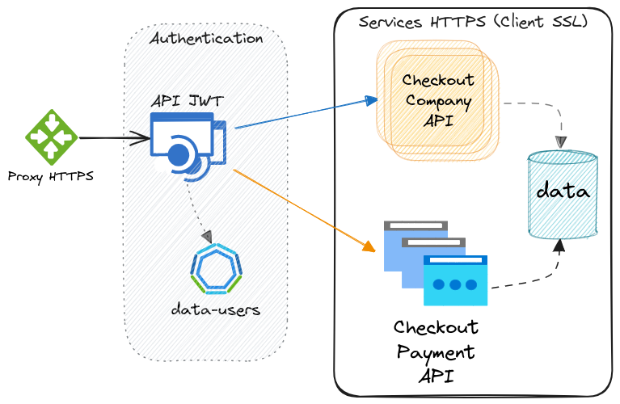

# checkout-deployment

Proyecto para desplegar los servicios provistos por los sistemas involucrados como solución de **Sesiones de Checkout**.

* [API integradora de sistema de sesione de checkout](https://github.com/janusky/checkout-api)
* [API de sistema de configuración checkout para empresas](https://github.com/janusky/checkout-company-api)
* [API de pagos de una sesión de checkout](https://github.com/janusky/checkout-payment-api)



## Run Docker 

```sh
# Descargar la versión deseada (por ejemplo: `master`)
git clone https://github.com/janusky/checkout-deployment.git

# Docker Compose
docker-compose up -d


# Check utils
psql -h localhost -U payment -d payment -p 5432
```

Obtener un token de sesión

```sh
curl -X POST "http://localhost:8081/auth/login" -H 'Content-Type: application/json' -d'
{
  "usernameOrEmail": "admin",
  "password": "admin"
}'
```

Acceder a la interface de OpenApi para probar los servicios expuestos

* http://localhost:8081/api-docs/swagger-ui/index.html

## TODO

* Hacer funcionar el proxy
* Agregar pruebas de estrés (JMeter, etc)
* Corregir la ejecución de docker-compose para que solo permita acceso a través del proxy
* Implementar archivos de configuración para desplegar en K8s.

## API Services

* [checkout-api](https://github.com/janusky/checkout-api)
* [checkout-company-api](https://github.com/janusky/checkout-company-api)
* [checkout-payment-api](https://github.com/janusky/checkout-payment-api)
